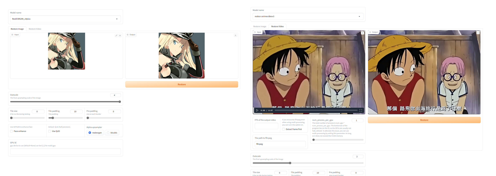

# Real-ESRGAN web UI

A browser interface based on Gradio library for [Real-ESRGAN](https://github.com/xinntao/Real-ESRGAN).



# Dependencies and Installation
- Python >= 3.7 (Recommend to use [Anaconda](https://www.anaconda.com/download/#linux) or [Miniconda](https://docs.conda.io/en/latest/miniconda.html))
- [PyTorch >= 1.7](https://pytorch.org/)

## Installation

1. Clone repo
   ```sh
   git clone https://github.com/coderxi1/Real-ESRGAN-webui.git --recurse-submodules
   cd Real-ESRGAN-webui
   ```
2. Install dependent packages
   ```sh
   # if use conda
   # conda create -n real-esrgan-webui python=3.10.9
   # conda activate real-esrgan-webui

   pip install basicsr
   pip install facexlib
   pip install gfpgan

   cd Real-ESRGAN #cd Real-ESRGAN submoudle to setup

   pip install -r requirements.txt
   python setup.py develop
   ```
3. Start webui
   ```sh
   cd .. #back to webui dir

   pip install gradio
   python webui.py
   ```

## Tip

If you encounter the following error, please check if torch is the CPU version.
```
ValueError: Number of processes must be at least 1

Error "slow_conv2d_cpu" not implemented for 'Half'
```
To check the torch version, you can run the following python code:
```
import torch
print(torch.__version__)
```

If the version string includes `+cpu` like `2.0.0+cpu` , it means that you have the CPU version of torch installed. Please visit the [pytorch.org](https://pytorch.org/get-started/locally/) to install the appropriate version.
   
- If you use `pip` to install, make sure to first uninstall the existing version(s) by running the following commands:
  ```sh
  # pip uninstall cpuonly (if installed)
  pip uninstall torch torchvision torchaudio
  ```
  After that, you can proceed with the new installation.

- If you use `conda` to install, you might get this error:
  ```
  ImportError: cannot import name 'COMMON_SAFE_ASCII_CHARACTERS' from 'charset_normalizer.constant'
  ```
  Use a lower version of `charset-normalizer` to fix it
  ```sh
  pip install charset-normalizer==2.1.0
  ```

## API
use `--api` and see `/docs`
